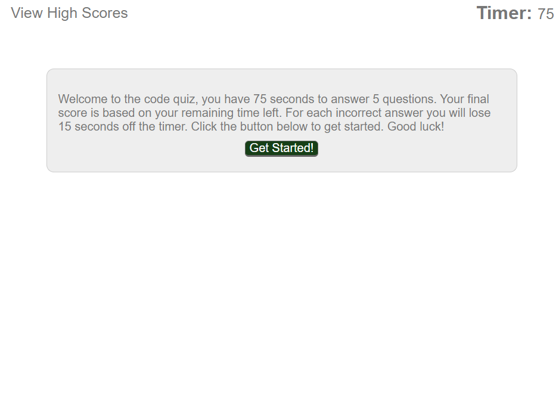
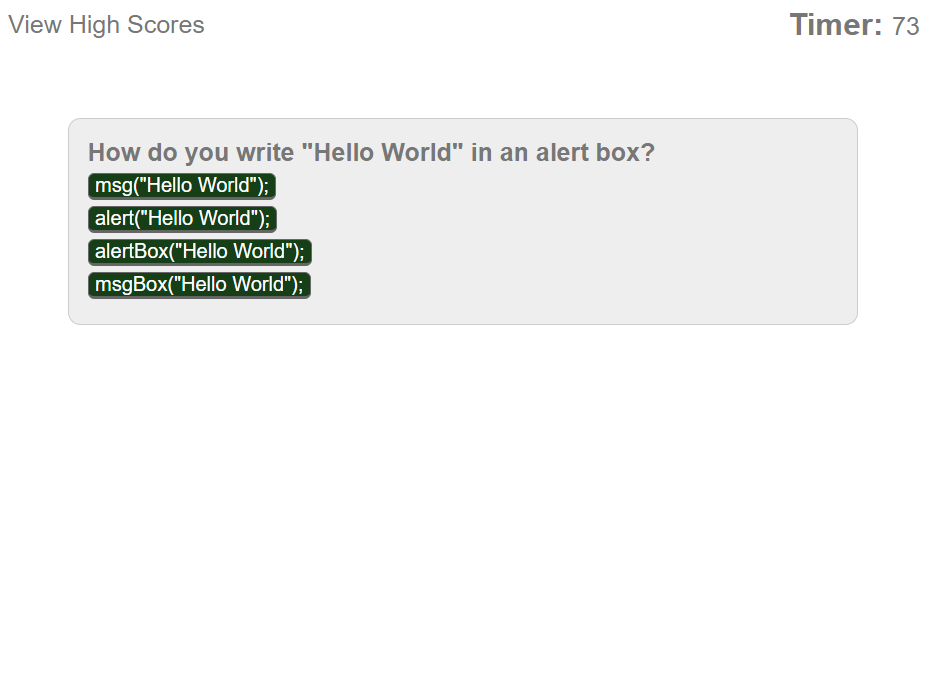
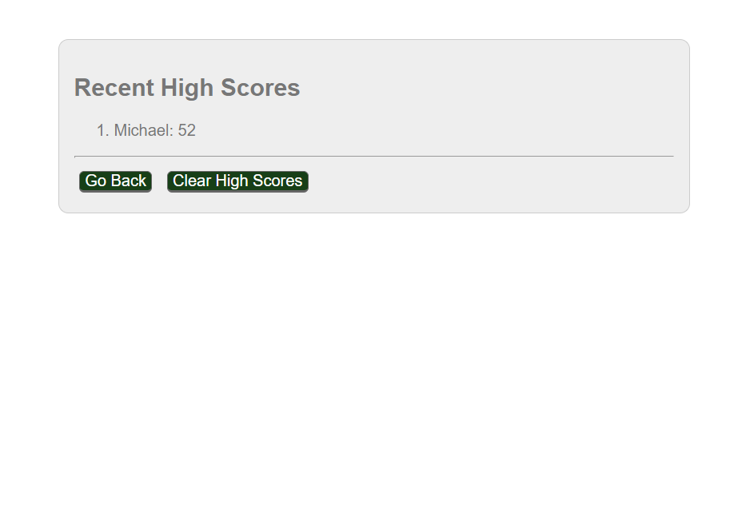

# Code-Quiz

## Description
This is a small javascript quiz game - the player is asked a set of timed questions about javascript. The players final score is based on the time remainig after all questions have been answered minus a penalty for each wrong answer. Players scores can be saved on a high scores page.

Deployment URL: https://michaelhrivnak.github.io/Code-Quiz/

## Installation

No installation required

## Usage 

The Player is prompted to begin the game, at which point questions are loaded one by one for the player to answer.
The game ends when the player runs out of time or they reach the end of the question set.
The player then is prompted to entier their name to save their score on a separate page. The player can view the list of recent scores, clear the list or go back to the beginning page to start the game again.

The order of questions and the list of possible answers are randomized each time to prevent repetitive play.

## Credits

None

## License

MIT License

Copyright (c) 2019 Michael Hrivnak

Permission is hereby granted, free of charge, to any person obtaining a copy
of this software and associated documentation files (the "Software"), to deal
in the Software without restriction, including without limitation the rights
to use, copy, modify, merge, publish, distribute, sublicense, and/or sell
copies of the Software, and to permit persons to whom the Software is
furnished to do so, subject to the following conditions:

The above copyright notice and this permission notice shall be included in all
copies or substantial portions of the Software.

THE SOFTWARE IS PROVIDED "AS IS", WITHOUT WARRANTY OF ANY KIND, EXPRESS OR
IMPLIED, INCLUDING BUT NOT LIMITED TO THE WARRANTIES OF MERCHANTABILITY,
FITNESS FOR A PARTICULAR PURPOSE AND NONINFRINGEMENT. IN NO EVENT SHALL THE
AUTHORS OR COPYRIGHT HOLDERS BE LIABLE FOR ANY CLAIM, DAMAGES OR OTHER
LIABILITY, WHETHER IN AN ACTION OF CONTRACT, TORT OR OTHERWISE, ARISING FROM,
OUT OF OR IN CONNECTION WITH THE SOFTWARE OR THE USE OR OTHER DEALINGS IN THE
SOFTWARE.
